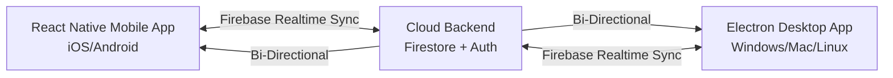

# 🏆 GoldDesk: Professional Gold Laboratory OS

**GoldDesk (Gold Bazar)** is a **unified cross-platform laboratory ecosystem** consisting of a **React Native mobile app** and an **Electron desktop application**, fully synced via a cloud backend. It untethers jewelers from their desks, enabling lab-grade gold testing, real-time market intelligence, and professional reporting from anywhere.

---

## 🎯 The Problem We Saw

The gold testing industry is trapped by a "Legacy Desk" paradigm, creating critical risks and inefficiencies:

- 🪑 **Tethered to a Terminal** — Jewelers are paralyzed by decade-old, offline desktop software. High-stakes testing and live pricing can't be performed away from the front counter.
- 🔄 **No Sync, No Freedom** — Data lives on one machine. If a jeweler tests gold in the field or at a client's location, that record never makes it back to the main office system.
- 💸 **Decimal-Level Financial Risk** — Manually calculating gold purity via fluid physics and converting to traditional units (**Tola/Masha/Ratti**) is error-prone. A tiny decimal mistake can cost thousands.
- 🖥️ **Two Worlds, One Choice** — Shops are forced to choose between a **powerful desktop terminal** (static) or a **basic mobile app** (weak features). No one offers both with sync.
- 📉 **Stale Market Data** — Most shops rely on manually updated rate boards. There's no real-time, automated feed for Ounce Spot (OS) prices.

> *The result?* Financial risk, operational paralysis, and a fragmented workflow where data lives in silos.

---
## 💡 The Solution We Built

**GoldDesk** is a **Mobile-First Revolution** that doesn't abandon the desktop. We built **two powerful clients** — React Native (Mobile) and Electron (Desktop) — that **talk to each other in real time**.

| Problem | Our Solution |
|:--------|:-------------|
| **Tethered to a Terminal** | **React Native Mobile App** — Perform lab-grade tests, generate PDF/thermal receipts, and access live market data from any iOS or Android device. |
| **No Sync, No Freedom** | **Bi-Directional Cloud Sync (Firebase)** — Test data, client records, and session states sync instantly between Mobile and Desktop. Start on mobile, finish on desktop. |
| **Decimal-Level Risk** | **Lab-Grade Physics Engine** — Archimedes' Principle algorithms tuned to 19.29g/cm³ density standards. Handles complex "borrowing" math for negative impurity (Kaat). |
| **Two Worlds, One Choice** | **Unified Ecosystem** — A powerful **Electron Desktop terminal** for front-counter operations + a **full-featured Mobile app** for field work. Same data, same features. |
| **Stale Market Data** | **Live Market Terminal (Electron)** — Real-time OS (Ounce Spot) Price board for Gold & Silver with custom cloud-caching to avoid API rate limits. |

### 🧠 What Makes GoldDesk Different?

- **One Ecosystem, Two Clients, Zero Compromise** — The mobile app isn't a "lite" version. It runs the same physics engine, generates the same reports, and syncs seamlessly with the desktop.
- **Physics Over Guesswork** — The app doesn't just calculate; it educates. It implements Archimedes' Principle to a **lab-grade standard**, removing human error from purity determination.
- **Enterprise-Grade Security Across Devices** — Strict **Device Fingerprinting** (max 2 devices per license) and remote session revocation. If a phone is lost, kill its access from the desktop.
- **Localized Math for Global Markets** — Custom logic flawlessly converts decimal grams into **Tola/Masha/Ratti** formats, respecting traditional South Asian market standards.

---

## 🔄 The Unified Ecosystem: Mobile + Desktop + Sync

| Client | Technology | Primary Use Case |
|:-------|:-----------|:-----------------|
| **Mobile** | React Native (Expo) | Field testing, on-site client visits, instant PDF/thermal receipts |
| **Desktop** | Electron + React | Front-counter operations, live market board, admin controls, heavy data entry |
| **Sync Engine** | Firebase Auth + Firestore | Real-time bi-directional sync, device fingerprinting, session management |

---

## ✨ Key Features & Technical Scope

### 🔄 Bi-Directional Sync (The Secret Sauce)
- **Real-time Cloud Sync** — Test records, client profiles, and session states sync instantly between Mobile and Desktop.
- **Offline-First Queue** — Mobile app queues operations when offline; syncs automatically when connection returns.
- **Device Fingerprinting** — Each license allows max 2 active devices. Remotely revoke any device from the admin portal.

### 🧪 Lab-Grade Physics Engine (Both Platforms)
- **Precision Algorithms**: Implementation of Archimedes' Principle tuned to localized density standards (19.29g/cm³) for exact Karat and purity determination.
- **Localized Math**: Custom logic to perfectly convert decimal grams into **Tola/Masha/Ratti** formats, including complex "borrowing" math for negative impurity (Kaat) scenarios.

### 📱 React Native Mobile App
- **On-the-Go Testing**: Perform complex lab tests and generate instant PDF reports from iOS or Android devices.
- **Instant Receipts**: Direct integration for mobile thermal printing and digital sharing with clients.
- **Offline Capable**: Full functionality without internet; syncs when back online.

### 🖥️ Electron Desktop App
- **Terminal Experience**: A modernized, robust desktop environment for front-counter operations.
- **Live Market Terminal**: Real-time **OS (Ounce Spot) Price** board for Gold and Silver with custom cloud-caching and multiple provider fallbacks.
- **CORS-proof IPC Fetching**: Secure market data fetching without exposing API keys.
- **Admin Controls**: User management, session revocation, and system analytics.

### 📊 Market Intelligence & Security
- **Live Market Terminal**: Real-time **OS (Ounce Spot) Price** board for Gold and Silver, utilizing custom cloud-caching to avoid API rate limits.
- **Enterprise Security**: Strict **Device Fingerprinting** (limited to 2 devices per license) and remote session revocation via a Firebase admin portal.

---
---

## 📸 Screenshots

### Home Screen

  

### Gold Screen

  
  

### Profile & Billing

  
  

---

## 🚀 Key Features

### 🔐 Security & Authentication
- Secure Login/Signup (Firebase)
- Forgot Password recovery
- Device Fingerprinting & Session Management
- Max 2 Devices per user (across Mobile + Desktop)
- Role-Based Access Control (Admin/User)

### 🛡️ Admin Portal
- User Management (Approve/Disable/Delete)
- Session Control (Active devices across both platforms, revoke remotely)
- Dashboard with system stats

### 🔬 Accurate Gold Testing
- Archimedes' Principle for purity calculation
- Real-time updates
- 9 composition analysis modes
- Traditional units: Ratti, Masha, Tola, Grams

### 💰 Advanced Pricing
- Real-time gold value calculation
- Configurable rates (per gram/tola)
- Wastage & labor cost support
- Shop branding in reports

### 🎨 Premium UI/UX
- Luxurious dark + gold theme
- Responsive design (Mobile + Desktop)
- Custom modals & profile management

---

## 🖥️ Electron Desktop App (Detailed)
- Live Market Board (Gold & Silver)
- Multiple providers + fallback
- CORS-proof IPC fetching
- Local caching & refresh limits
- Thermal printing & PDF export
- Role-based authentication
- Admin user management dashboard

---

## 📱 React Native Mobile App (Detailed)
- Lab-grade gold testing
- Multiple report formats
- Traditional units supported
- Secure session model with device fingerprinting
- PDF/Print/Share flows
- Offline-first queue for field operations
- Mobile thermal printing support

---
## 🛠️ Technical Stack

| Layer | Technology |
| --- | --- |
| **Mobile Client** | React Native (Expo) |
| **Desktop Client** | Electron.js + React |
| **Backend / Sync Engine** | Firebase Auth & Firestore |
| **API Automation** | GitHub Actions for Backend Cron Jobs |
| **Styling** | Premium Dark & Gold UI (Tailwind CSS) |

---

## ✨ Gold Bazar Key Highlights
- **Unified Cross-Platform Ecosystem** — React Native Mobile + Electron Desktop with bi-directional Firebase sync
- **Lab-Grade Physics Engine** — Archimedes' Principle implementation for precise gold purity determination
- **Traditional Unit Conversion** — Tola, Masha, Ratti, Grams, Ounces with complex "borrowing" math
- **Live Market Intelligence** — Real-time OS (Ounce Spot) prices for Gold & Silver
- **Device Fingerprinting Security** — Max 2 devices per license, remote revocation
- **Offline-First Mobile** — Full functionality without internet; auto-sync when back online
- **Premium Dark & Gold UI** — Luxurious, professional interface on both platforms

A perfect blend of **physics education**, **cross-platform architecture**, and **enterprise-grade security**.

---
